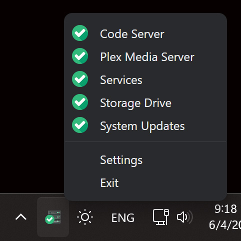
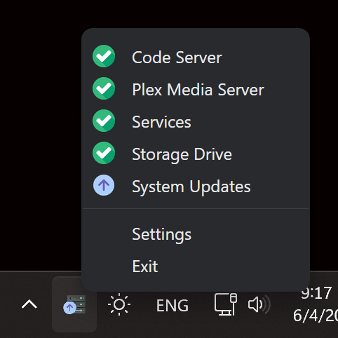
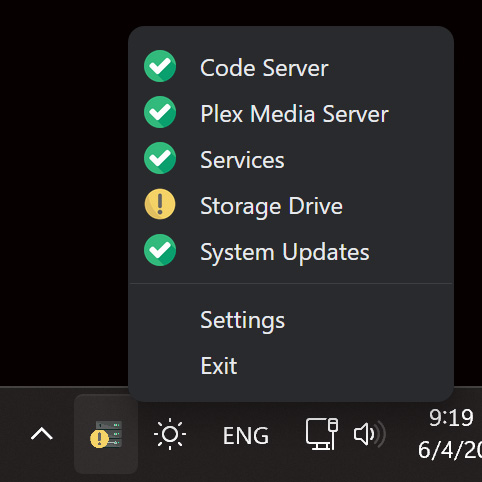
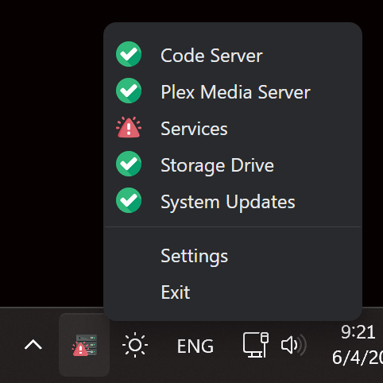

# Service Status Indicator Client

## Demo

<div style="display: flex; overflow: hidden">




</div>

## Description

The Service Status Indicator is a Linux monitoring tool. It's able to monitor the status of system updates, hardware stages, various services, basically everything. It relies on a backend API that provides essential data, including predefined check scripts for common use cases. You can also easily expand its functionality by creating and adding your own custom service checker and script.

## Target Audience

The Service Status Indicator targets users who want to have an eye on some services of a Linux system. While it is primarily designed for server use, it can be used locally as well.

## Installation

### Prerequisites

Before installing the Service Status Indicator Client, you need to have the Service Status Indicator API backend installed and running on the Linux machinethat you want to monitor. You can find more information about the backend installation and usage in the [Service Status Indicator API repository](https://github.com/RemiZlatinis/service_status_indicator_api.git).

### Download a Release:

https://github.com/RemiZlatinis/service-status-indicator-client/releases

### Manual

#### Manual Prerequisites

- Node JS
- Yarn or npm

To run the Service Status Indicator Client manually from the Git repository, follow the instructions below:

1. Clone this repository:

   ```shell
   git clone https://github.com/RemiZlatinis/service-status-indicator-client.git
   ```

2. Install node modules:

   ```shell
   yarn install
   ```

3. Run:

   ```shell
   yarn start
   ```

   That's it! The Service Status Indicator Client should now be running on your environment.

## Usage

After installing, you should set the the URL for the backend API endpoint (e.g. http://localhost:8000) and the authentication token. Save the changes and you are good to go.

**Note**: Please note that in order for the indicator to function properly, your backend must have at least one service checker. Otherwise, the response will be considered invalid.

## Contributing

If you would like to contribute to the Service Status Indicator Client, please read the [CONTRIBUTING.md](CONTRIBUTING.md) file for guidelines on how to contribute to the project.

## Credits

The Service Status Indicator Client was created by Apostolos Zlatinis and is licensed under the GPLv2 license.

Modifited icons from Flaticon are used

&#x2011;


<a href="https://www.flaticon.com/free-icons/server" title="server icons">Server icons created by Roundicons - Flaticon</a>
<a href="https://www.flaticon.com/free-icons/warning" title="warning icons">Warning icons created by Freepik - Flaticon</a>
<a href="https://www.flaticon.com/free-icons/attention" title="attention icons">Attention icons created by bearicons - Flaticon</a>
<a href="https://www.flaticon.com/free-icons/tick" title="tick icons">Tick icons created by Roundicons - Flaticon</a>
<a href="https://www.flaticon.com/free-icons/update" title="update icons">Update icons created by Freepik - Flaticon</a>

## License

This project is licensed under the GPLv2 license. See the [LICENSE.md](LICENSE.md) file for details.
